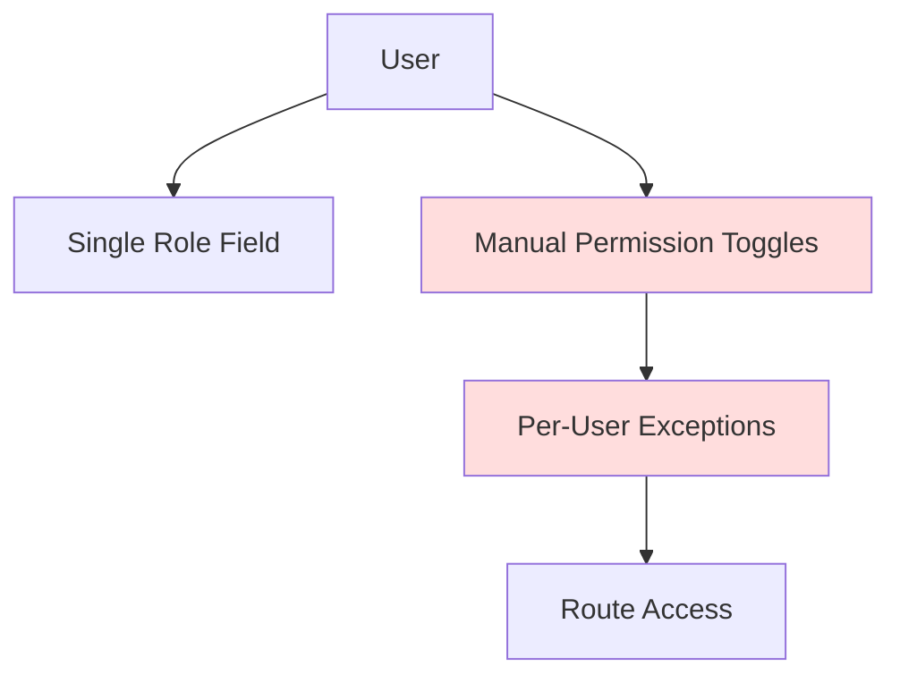
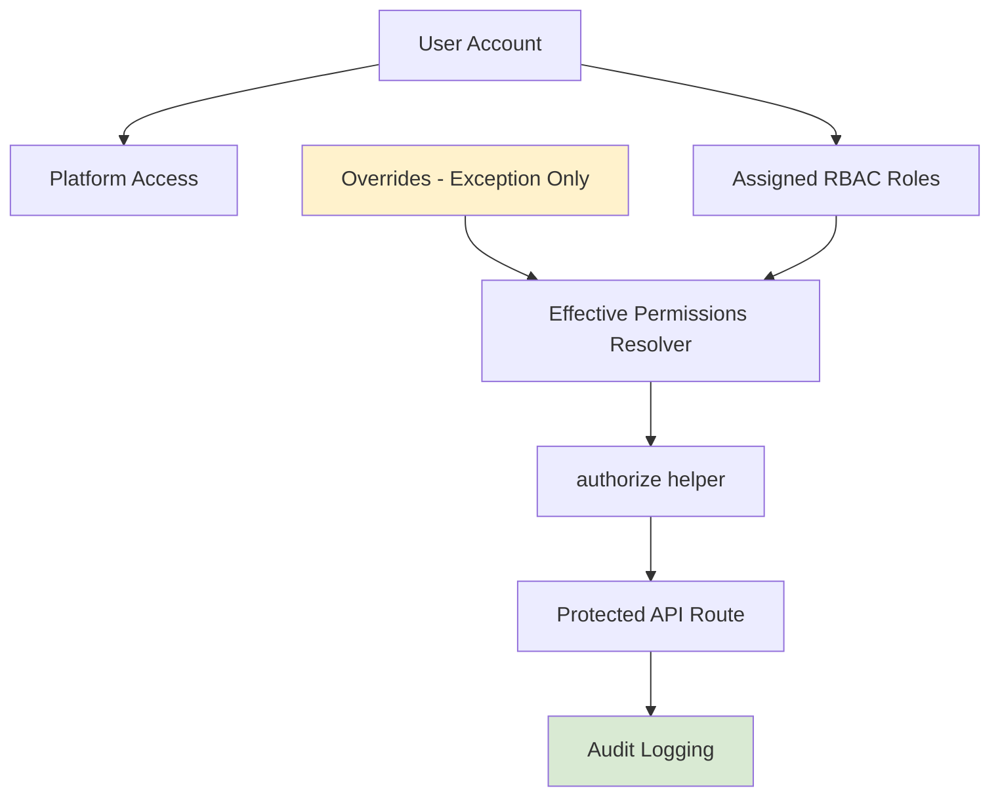
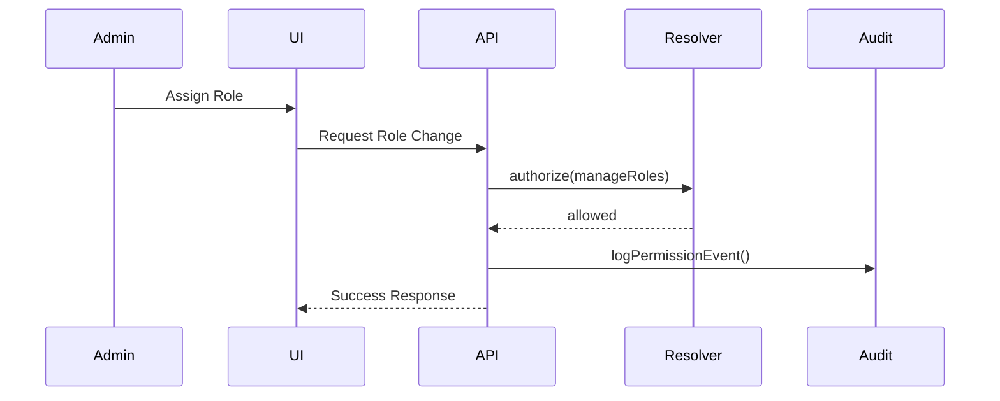
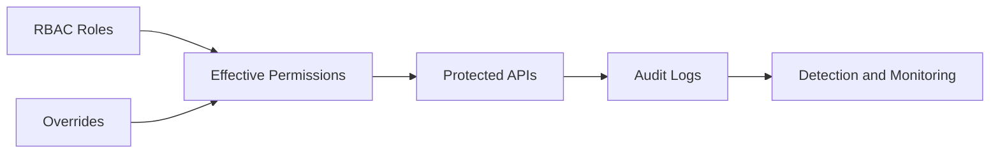

# Fence Wizard RBAC Migration Architecture

## Objective

Document the transition from legacy single-role and per-user permission management to a centralized RBAC-first security model.

## Security Goal

Move from:

```text
Manual per-user permissions + role assumptions
```

To:

```text
Centralized RBAC + effective permissions + audited exceptions
```

---

# Legacy Architecture (Before)



## Legacy Risks

| Risk | Description |
|---|---|
| Permission drift | Every user becomes unique |
| Hidden privilege escalation | Overrides accumulate silently |
| Poor auditability | Difficult to explain effective access |
| UI inconsistency | Single-role assumptions |
| Security gaps | Mixed auth patterns |

---

# Target RBAC Architecture (After)



---

# RBAC UI Architecture

## Primary Navigation

```text
Accounts | Org Structure | Role Policies | Overrides | Audit Log
```

## Separation of Concerns

| Area | Responsibility |
|---|---|
| Platform Access | Login/admin tier |
| Assigned Roles | Business permissions |
| Org Structure | Reporting hierarchy |
| Overrides | Exception-only controls |
| Audit Log | Security traceability |

---

# Effective Permissions Flow



---

# Override Governance Model

## Correct Override Usage

Overrides should:

- be temporary,
- require a reason,
- be logged,
- and remain secondary to roles.

## Incorrect Usage

Overrides must not become:

- custom user roles,
- silent privilege escalation,
- permanent entitlement shortcuts.

---

# PM Assignment Capacity Integration

## Migration Goal

Fold legacy PM profile management into the RBAC-first admin experience without changing the assignment engine.

## Constraints

- Keep existing PMProfile schema
- Keep assignmentEngine.ts behavior stable
- Do not auto-create PM profiles
- Preserve current assignment failure behavior

---

# Authorization Enforcement Strategy

## Standard Pattern

```ts
await authorize(userId, 'permission_key')
```

## Security Requirements

- Deny by default
- Fail closed
- No client-only authorization assumptions
- Log sensitive mutations

---

# Migration Phases

| Phase | Focus | Status |
|---|---|---|
| Phase 1 | RBAC foundation and resolver | Complete/In Progress |
| Phase 2 | Enforcement and audit hardening | Active |
| Phase 3 | Detection and SOC integration | Planned |
| Phase 4 | Offensive validation and testing | Planned |
| Phase 5 | Governance and architecture maturity | Planned |

---

# High-Risk Migration Areas

| Area | Risk |
|---|---|
| Legacy User.role dependencies | Inconsistent authorization |
| Email-based bypasses | Hidden escalation |
| Missing route enforcement | Access bypass |
| Unlogged overrides | Insider-risk blind spots |
| Client-side permission assumptions | Security inconsistency |

---

# Final Target State



## Desired Outcomes

- Consistent access control
- Reduced permission drift
- Centralized authorization
- Strong auditability
- Cleaner admin workflows
- Easier incident investigation
