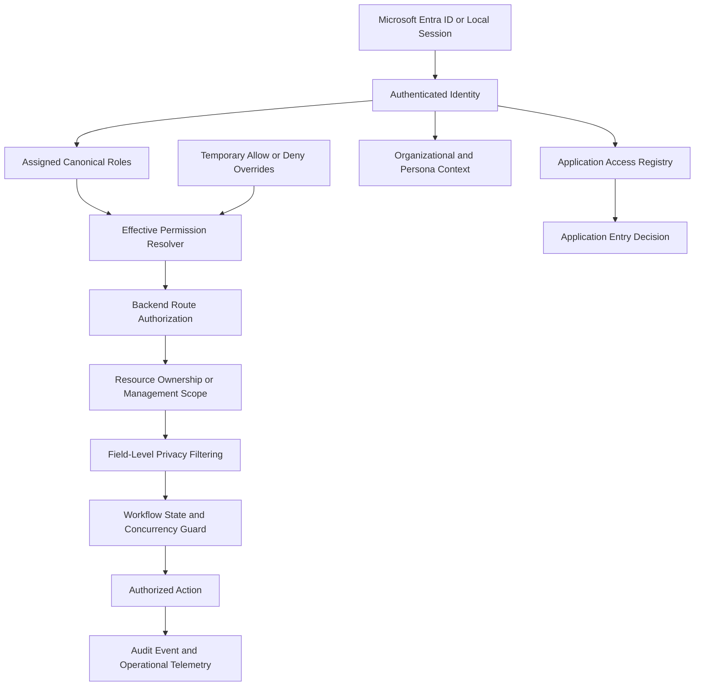
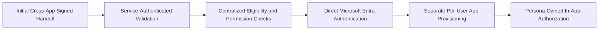

# Current Identity and Authorization Architecture

## Purpose

This document provides a sanitized view of the current identity, application-provisioning, authorization, privacy, and audit architecture represented across the portfolio.

It is designed for public proof-of-work and intentionally excludes proprietary code, internal identifiers, employee data, customer information, tokens, and production configuration.

## End-to-End Decision Flow

## Security Decision Boundaries

### Authentication

Authentication confirms identity and session validity. It does not, by itself, grant application entry or feature authority.

### Application Provisioning

Per-user application access determines whether an authenticated identity may enter a connected application.

### Persona and Role Context

Personas and canonical roles provide business context and expected capabilities. They do not replace backend authorization.

### Effective Permissions

The resolver combines canonical role grants with explicit, auditable allow or deny exceptions. Default deny applies where no valid grant exists.

### Route Authorization

Backend routes enforce permissions regardless of what the client displays.

### Resource Authorization

A user who may access a route may still be restricted to records they own, are assigned, or are explicitly allowed to manage.

### Field-Level Privacy

Authorized records may still contain manager-only notes, internal metadata, or other restricted fields that must be removed before returning the response.

### State and Concurrency Guards

The current record state, transition policy, and guarded update result determine whether a workflow mutation is valid. Rejected or losing concurrent updates must not produce false success events.

### Audit and Telemetry

Security decisions and sensitive state changes generate reviewable events for accountability, investigation, and future detection logic.

## Architecture Evolution

## Threats Addressed

- Client-only authorization bypass
- Legacy single-role assumptions
- Accidental-public backend routes
- Cross-user resource access
- Identifier enumeration
- Internal metadata leakage
- Stale role or permission state
- Uncontrolled application trust
- Invalid or replayed external access tokens
- Unauthorized workflow reversal
- False audit events caused by concurrency races

## Assurance Activities

- Route enforcement inventories
- Permission matrices
- Architecture diagrams
- Adversarial privacy and authorization review
- Regression tests for confirmed findings
- Audit-event schema documentation
- Public evidence sanitization

## Scope Note

The enterprise email and notification architecture is not included because authorship and contribution boundaries require separate manual verification before it is represented as portfolio proof-of-work.
