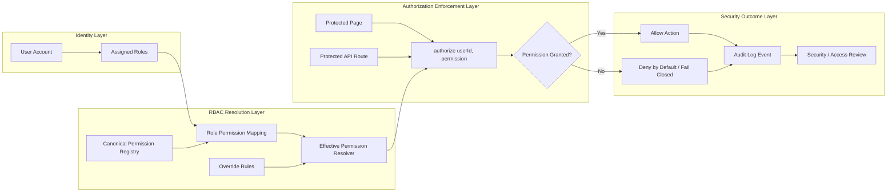

# Fence Wizard RBAC Routing Diagram

This document summarizes the role-based access control routing model implemented for Fence Wizard. The diagram shows how user roles, canonical permissions, overrides, backend authorization checks, and audit events work together to enforce access control.

## RBAC Permission Routing



## Control Logic

The RBAC model follows a role-first structure:

```text
User → Assigned Roles → Effective Permissions → Backend Authorization Check → Allow or Deny
```

Permission overrides are treated as exceptions, not the primary access model. The intended security behavior is deny-by-default and fail-closed, meaning access should only be granted when a valid permission is explicitly resolved and authorized.

## Security Value

This model supports:

- Centralized authorization logic
- Reduced single-role assumptions
- Clearer least-privilege enforcement
- Better auditability of allowed and denied actions
- A stronger foundation for future monitoring, dashboards, and security review workflows
