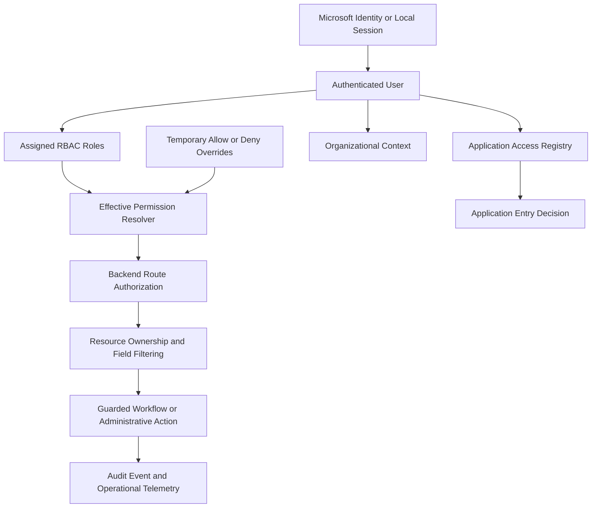

# Fence Wizard RBAC Security Hardening

> **Document status:** Current sanitized evidence hub.
> **As of:** 2026-08-04
> [Current Control Status](../docs/current-control-status.md) is authoritative; this page does not independently establish operating effectiveness.

## Overview

This project documents the production security-hardening program for Fence Wizard, an internal business platform supporting multiple departments and workflows. The work evolved from an initial role-model redesign into a broader authorization assurance program covering multi-role RBAC, backend route protection, application provisioning, auditability, privacy boundaries, and regression validation.

The work aligns with the current roadmap focus: **Governance-Aware Security Engineering and Detection Engineering Foundations**.

## Objective

Build and continuously validate an auditable access-control foundation that supports:

- Multi-role RBAC assignment
- Least-privilege and deny-by-default authorization
- Effective permission visibility
- Exception-based override governance
- Separate application provisioning and in-app authorization
- Resource ownership and field-level privacy controls
- Protected administrative and workflow state transitions
- Detection-ready audit events

## Tools Used

- Next.js
- Prisma
- Neon PostgreSQL
- Render
- GitHub
- Cursor
- TypeScript
- Microsoft Entra ID concepts
- NIST-style access-control documentation

## Current Security Architecture

## Access-Control Layers

| Layer | Purpose |
|---|---|
| Authentication | Confirms the user identity and active session |
| Application Provisioning | Determines which connected applications the user may enter |
| Assigned Roles | Supplies canonical business permissions |
| Persona or Context | Adapts experience and responsibilities without replacing authorization |
| Effective Permissions | Resolves role grants and explicit exceptions |
| Route Authorization | Enforces access at backend endpoints |
| Resource Authorization | Verifies ownership or management rights for individual records |
| Field Filtering | Prevents lower-privilege users from receiving restricted metadata |
| Audit Logging | Records security-sensitive decisions and changes |

## Reported Controls and Evidence Basis

### Multi-Role RBAC

- Database-backed canonical roles and permissions
- Multi-role assignment support
- Backend effective-permission resolution
- Permission-gated navigation and workflow actions
- Reduced reliance on legacy single-role assumptions
- Protected role administration and stale-write safeguards

### API Authorization

- Centralized authorization wrappers for authenticated routes
- Route-by-route sweeps for accidental-public endpoints
- Explicit documentation of public, OAuth, portal, and service exceptions
- Consistent unauthorized and forbidden response patterns
- Backend enforcement independent of front-end visibility

### Resource and Privacy Authorization

- Ownership checks for user-associated records
- Management exceptions limited to authorized roles
- Equivalent errors for missing and unauthorized records to reduce enumeration risk
- Field-level filtering for internal notes and manager-only metadata
- Restricted activity counts and summaries based on viewer visibility

### Application Provisioning

- Per-user application access registry
- Separation between authentication, application entry, and feature permissions
- Migration away from using one application's RBAC permissions as another application's full authorization model
- Persona-based downstream authorization retained within the connected application

### Protected State Changes

- Guarded workflow transitions
- Concurrent-update checks before writing events or notifications
- Prevention of stale or unauthorized links moving records backward
- Audit correctness tied to successful state mutation

## Authorization Assurance Process

The hardening program uses several assurance activities:

1. Inventory protected routes and mutation paths.
2. Verify authentication and permission enforcement.
3. Test resource ownership and information filtering.
4. Review public and service-to-service exceptions explicitly.
5. Run adversarial reviews for disclosure, enumeration, stale-state, and race-condition issues.
6. Add regression tests for confirmed findings.
7. Record administrative and authorization outcomes as audit events.

## Audit Logging Requirements

Security-sensitive events should capture enough context to answer who performed the action, what changed, which control authorized it, and whether the result succeeded.

Recommended fields:

| Field | Description |
|---|---|
| actorUserId | User or service performing the action |
| targetUserId | User affected by an access change, when applicable |
| actionType | Authorization, role assignment, override, workflow transition, or administrative action |
| permissionUsed | Permission or service trust decision used |
| entityType | Affected object type |
| entityId | Affected object identifier |
| result | Allowed, denied, failed, or completed |
| reason | Human-readable or machine-readable decision reason |
| timestamp | Event time |
| before | Previous state where practical |
| after | New state where practical |

## Current Assurance Status

The authoritative, dated control-family status is maintained in [Current Control Status](../docs/current-control-status.md). In summary, reviewed authorization controls are privately implemented with sanitized evidence and ongoing validation; public detection logic remains design-only. This page intentionally does not duplicate a mutable completion checklist.

## Detection Opportunities

Potential detections that could be built from the documented telemetry foundation; these are design opportunities, not claims of deployed analytics:

- Repeated authorization denials across sensitive routes
- Sudden assignment of privileged roles
- High-volume or long-lived overrides
- Access attempts against resources owned by other users
- Repeated application-access denials
- Service-authentication failures
- Unusual after-hours administrative activity
- Conflicting or repeated workflow-transition attempts

## GRC Alignment

| Control Area | Alignment |
|---|---|
| Account Management | NIST AC-2 concepts |
| Access Enforcement | NIST AC-3 concepts |
| Least Privilege | NIST AC-6 concepts |
| Audit Events | NIST AU-2 and AU-3 concepts |
| Audit Review | NIST AU-6 concepts |
| Change Control | NIST CM-3 concepts |
| Identification and Authentication | NIST IA concepts |

This mapping is planning-oriented and does not claim formal assessment or certification.

## Key Takeaways

- Authentication, application provisioning, and authorization are separate security decisions.
- Front-end visibility does not replace backend enforcement.
- Multi-role access reduces pressure to create unmanaged per-user permission combinations.
- Object-level authorization and field filtering are necessary even after route authorization succeeds.
- Audit events must represent successful security decisions accurately, especially under concurrent updates.
- Security hardening is an ongoing assurance process rather than a one-time migration.

## Public Documentation Sanitization

Public artifacts must exclude real employee information, internal URLs, tokens, secrets, customer data, production hostnames, and proprietary implementation details. Sanitized diagrams and control-level summaries should be used instead.
