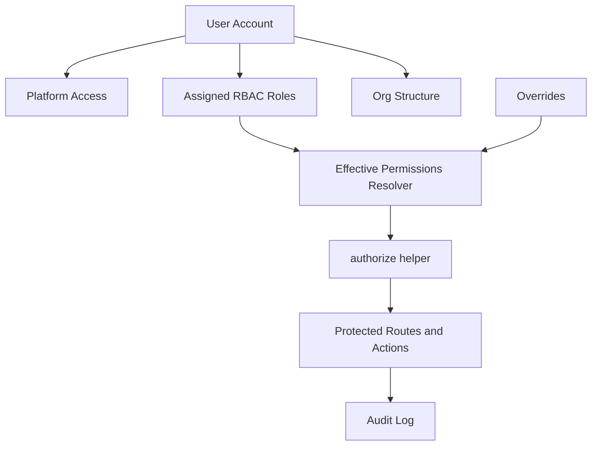

# Fence Wizard RBAC Security Hardening

## Overview

This project documents the security hardening work for the Fence Wizard application, focused on replacing legacy single-role and per-user permission workflows with a role-based access control model.

The work is aligned to the current roadmap phase: **Phase 2 – Security Hardening**.

## Objective

Build a documented, auditable access-control foundation for Fence Wizard that supports:

- Multi-role RBAC assignment
- Least-privilege access
- Effective permission visibility
- Override controls as exceptions only
- Audit-ready administrative workflows
- Separation between platform access, RBAC roles, and organizational hierarchy

## Tools Used

- Next.js
- Prisma
- Neon PostgreSQL
- Render
- GitHub
- Cursor
- TypeScript
- NIST-style access-control documentation

## Architecture / Setup

Fence Wizard uses a staged access-control model:



### Access Layers

| Layer | Purpose | Example |
|---|---|---|
| Platform Access | Determines whether a user can access the application/admin area | ADMIN, STANDARD_USER |
| Assigned Roles | Determines what business permissions a user receives | platform_admins, project_managers, pma, operator, inventory |
| Org Structure | Defines reporting and business hierarchy | reportsTo, team, division, branch |
| Overrides | Exception-only permission changes | temporary allow/deny |
| Audit Log | Tracks sensitive access-control changes | role assignment, override change, PM profile edit |

## RBAC Design Principles

### 1. Roles Are Primary

Permissions should be granted through canonical RBAC roles, not through manual per-user permission grids.

Correct model:

```text
User -> Assigned Roles -> Effective Permissions -> Authorized Actions
```

Avoid:

```text
User -> Manual Permission Toggles
```

### 2. Multi-Role Support

The UI and backend must not assume one user equals one role.

Examples:

- PMA + Operator
- Project Manager + Equipment
- Inventory + Purchasing

### 3. Overrides Are Exceptions

Overrides must be visually and operationally demoted.

Rules:

- Use only for temporary or unusual exceptions
- Require a reason
- Log all override changes
- Show expiration where supported
- Do not use overrides to build custom per-user roles

### 4. Effective Permissions Come From Backend Resolver

The UI must never calculate permissions locally.

Required backend contract:

```ts
getUserPermissions(userId)
```

Expected response fields:

| Field | Purpose |
|---|---|
| permissionKey | Canonical permission identifier |
| allowed | true or false |
| source | role, override, or legacy |
| roleName | Source role when applicable |
| overrideReason | Reason when override applies |

## Admin UI Documentation

Target admin navigation:

```text
Accounts | Org Structure | Role Policies | Overrides | Audit Log
```

### Accounts

Primary access-management workflow.

Must show:

- User identity
- Platform access badge
- Assigned roles as multi-role chips
- Effective permissions summary
- Override summary
- Reports-to/team/branch information
- Assignment Capacity Profile where relevant

### Org Structure

Keeps reporting hierarchy separate from RBAC roles.

Must show:

- Reports-to relationships
- Team/division
- Branch
- Manager hierarchy

### Role Policies

Read-only or controlled-editing view of role-to-permission mappings.

Must show:

- Role name
- Role description
- Permission count
- Included permissions
- High-risk role indicators

### Overrides

Exception-management view only.

Required warning copy:

```text
Overrides are exceptions and should be used sparingly. Excessive overrides weaken role-based access control.
```

### Audit Log

Tracks permission-sensitive events.

Minimum event types:

- Role assignment changed
- Override created/updated/removed
- PM assignment profile edited
- Access request approved/rejected
- High-risk action authorized

## Permission Gates

Each admin area should be explicitly permission-gated.

| Area | View Permission | Mutation Permission |
|---|---|---|
| Accounts | viewDispatch or admin baseline | managePMProfiles / admin-level role assignment permission |
| Role Policies | platform_admins or general_manager | platform_admins only |
| Overrides | admins only | overrideAssignment |
| Assignment Capacity Profile | assignment-related roles/admins | managePMProfiles |
| Audit Log | admins or GM only | none; read-only |

## Assignment Capacity Profile Integration

The legacy standalone PM Profiles screen should be consolidated into the RBAC-first admin experience.

### Rules

- Do not remove the PMProfile Prisma model
- Do not modify assignmentEngine.ts behavior
- Do not auto-create PMProfile records
- Reuse existing PMProfile APIs where possible
- Preserve existing assignment failure behavior when no profiles exist

### Fields

| Field | Mode |
|---|---|
| allowedTiers | Editable |
| specializations | Editable |
| maxCapacity | Editable |
| currentLoad | Read-only |
| activeTakeoffs | Read-only |

### Missing Profile Warning

```text
No assignment profile configured — takeoff assignment may fail.
```

## Audit Logging Requirements

All mutation paths must call a centralized audit/logging wrapper.

Minimum fields:

| Field | Description |
|---|---|
| actorUserId | User performing the action |
| targetUserId | User affected by the action |
| actionType | Role assignment, override change, approval, etc. |
| permissionUsed | Permission required to perform action |
| entityType | Affected object type |
| entityId | Affected object ID |
| timestamp | Event time |
| before | Previous state where practical |
| after | New state where practical |

Example:

```ts
logPermissionEvent({
  actorUserId,
  targetUserId,
  permissionUsed: 'managePMProfiles',
  actionType: 'PM_PROFILE_UPDATED',
  entityType: 'PMProfile',
  entityId: profileId,
})
```

## Route Enforcement Backlog

High-risk routes should be protected with a centralized authorization helper.

Priority areas:

1. Proposals
   - lockProposal
   - markSold
2. Inventory
   - manageInventory
   - approveInventoryAdjustment
   - postInventoryCorrection
3. Scheduling / Dispatch
   - manageSchedule
   - dispatchAssign
4. System-level actions
   - overrideAssignment
   - editJobNumber

Expected helper pattern:

```ts
authorize(userId, 'permission_key')
```

## Security Concepts

- Least privilege
- Separation of duties
- Role-based access control
- Deny-by-default authorization
- Fail-closed security behavior
- Auditability
- Permission drift reduction
- Exception governance
- Dev/prod separation

## GRC Alignment

| Control Area | Alignment |
|---|---|
| Access Control | NIST AC-2, AC-3, AC-6 |
| Audit Logging | NIST AU-2, AU-3, AU-6 |
| Least Privilege | NIST AC-6 |
| Change Traceability | NIST CM-3 |
| Risk Reduction | Reduces unauthorized access and permission drift |

## Implementation Checklist

- [ ] Replace single Operational Role UI with Assigned Roles multi-select
- [ ] Rename Org Role column to Assigned Roles
- [ ] Add Effective Permissions read-only panel
- [ ] Add role source indicator: Legacy vs RBAC
- [ ] Add Override summary as secondary workflow
- [ ] Add warning banner for overrides
- [ ] Integrate Assignment Capacity Profile into Accounts UI
- [ ] Remove/retarget standalone `/admin/pm-profiles` navigation
- [ ] Add authorization checks to mutation routes
- [ ] Add audit logging hooks to all mutation paths
- [ ] Inventory remaining legacy `User.role` assumptions
- [ ] Inventory routes using email-based bypasses
- [ ] Verify production routes fail closed

## Key Takeaways

- RBAC must be enforced server-side, not only represented in the UI.
- Multi-role assignment prevents artificial single-role workarounds.
- Overrides should exist, but only as audited exceptions.
- Effective permissions must be resolver-driven to avoid client-side security bugs.
- PM assignment capacity can be consolidated into the admin RBAC experience without changing the assignment engine.

## Public Documentation Sanitization

Before sharing screenshots or writeups publicly, remove or replace:

- Real emails
- Internal URLs
- API keys
- Database names
- Production hostnames
- Customer/job identifiers

Use placeholders such as:

```text
example-user@example.com
internal system
example database
```
