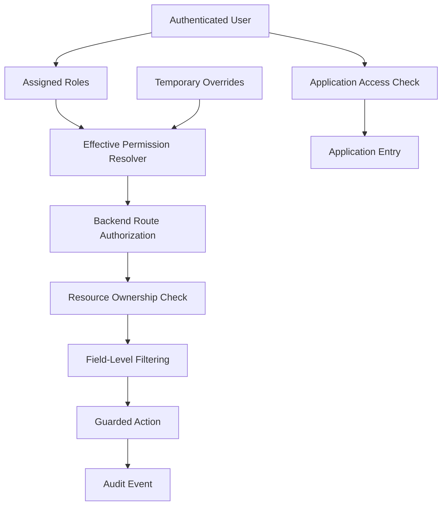

# Role Permission Simulation Lab

## Lab Overview

This lab models a modern access-control system using multi-role RBAC, application provisioning, explicit overrides, object ownership checks, field-level filtering, and audit events.

The lab is a sanitized technical reproduction of security concepts used in production work. It does not copy private company code, identifiers, or business data.

## Objectives

Demonstrate how a security-aware authorization design can:

- Resolve permissions from multiple roles
- Deny access by default
- Apply temporary allow and deny overrides
- Separate application access from in-app permissions
- Enforce backend route permissions
- Restrict access to individual resources
- Filter sensitive fields based on viewer context
- Guard state transitions
- Produce useful audit events
- Support regression and adversarial testing

## Suggested Lab Structure

```text
labs/role-permission-simulation/
├── README.md
├── resolver-example.ts
├── authorization-example.ts
├── sample-users.json
├── sample-resources.json
├── override-scenarios.md
├── authorization-tests.md
├── audit-log-examples.json
└── threat-model.md
```

## Simulated Roles

| Role | Purpose |
|---|---|
| platform_admin | Manage platform configuration and role assignments |
| security_admin | Review access and audit activity |
| project_manager | Manage assigned projects and related workflows |
| project_assistant | Support project workflows with reduced authority |
| dispatcher | Manage scheduling and dispatch actions |
| inventory_manager | Manage inventory operations |
| inventory_counter | Perform scoped inventory counts |
| support_manager | Manage support tickets and internal notes |
| standard_user | Access personal and generally available workflows |

## Simulated Permissions

| Permission | Description |
|---|---|
| manageRoles | Assign and remove canonical roles |
| manageOverrides | Create, expire, or remove permission exceptions |
| viewAuditLog | Review security and administrative events |
| manageSchedule | Modify schedules and dispatch plans |
| dispatchAssign | Assign drivers or equipment |
| editProject | Modify authorized project records |
| manageInventory | Modify inventory records |
| approveInventoryAdjustment | Approve sensitive corrections |
| manageSupportTickets | View and manage support boards |
| viewInternalNotes | View restricted support notes |
| manageAppAccess | Provision access to connected applications |

## Identity and Access Model



## Effective Permission Model

```text
Role grants + explicit allow overrides - explicit deny overrides = effective permissions
```

Recommended precedence:

1. Explicit deny override
2. Explicit allow override
3. Role-derived grant
4. Default deny

Overrides should include a reason, creator, start time, optional expiration, and audit event.

## Example User

```json
{
  "id": "user-1042",
  "apps": ["fence-wizard", "compass"],
  "roles": ["project_assistant", "dispatcher"],
  "overrides": [
    {
      "permission": "manageSchedule",
      "effect": "deny",
      "reason": "Temporary separation-of-duties restriction",
      "expiresAt": "2026-09-01T00:00:00Z"
    }
  ]
}
```

Expected result:

- Application entry allowed for listed applications
- Permissions from both assigned roles are combined
- `manageSchedule` remains denied because the explicit deny takes precedence
- Sensitive actions still require backend enforcement

## Authorization Layers to Test

### 1. Authentication

Reject missing, expired, or revoked sessions.

### 2. Application Provisioning

An authenticated user without the target application flag must not enter that application.

### 3. Route Permission

A user must hold the required permission before the route processes the request.

### 4. Resource Ownership

A standard user may view only records they own or are assigned to. Management roles may receive explicit broader scope.

### 5. Field-Level Filtering

A user may be authorized to view a record while still being prohibited from receiving internal notes, manager comments, or restricted metadata.

### 6. State-Transition Guard

A valid permission does not automatically authorize every transition. The current record state and transition policy must also permit the requested action.

## Example Authorization Pseudocode

```ts
type AuthorizationRequest = {
  userId: string;
  application: string;
  permission: string;
  resource?: {
    ownerId?: string;
    assignedUserIds?: string[];
  };
};

async function authorize(request: AuthorizationRequest) {
  const user = await loadUserSecurityContext(request.userId);

  if (!user.sessionActive) return { allowed: false, reason: "session_invalid" };
  if (!user.appAccess.includes(request.application)) {
    return { allowed: false, reason: "application_not_provisioned" };
  }

  const permissions = resolveEffectivePermissions(user.roles, user.overrides);
  if (!permissions.has(request.permission)) {
    return { allowed: false, reason: "permission_denied" };
  }

  if (request.resource && !canAccessResource(user, request.resource)) {
    return { allowed: false, reason: "resource_forbidden" };
  }

  return { allowed: true, reason: "authorized" };
}
```

## Attack and Regression Scenarios

### Privilege Escalation

A standard user calls an administrative endpoint directly.

Expected:

- Backend denial
- No mutation
- Security event recorded where appropriate

### Client-Side Role Tampering

A user modifies front-end state to display restricted controls.

Expected:

- Backend authorization still denies the action

### Object-ID Enumeration

A user requests sequential resource identifiers belonging to other users.

Expected:

- Unauthorized records are not disclosed
- Missing and forbidden records use equivalent external responses when appropriate

### Internal Metadata Leakage

A user can view a support ticket but not manager-only notes.

Expected:

- Restricted notes and related metadata are removed server-side
- Visible counts reflect only authorized content

### Stale Permission State

A privileged role is removed while a browser session remains active.

Expected:

- Server-side permission resolution reflects the current assignment
- Sensitive mutations are denied after removal

### Override Abuse

An administrator creates repeated long-lived overrides.

Expected:

- Every override is attributable and reviewable
- Expiration and justification requirements are enforced
- Monitoring can identify unusual override volume

### Application Access Boundary

A user is authenticated and has in-app role data but is not provisioned for the application.

Expected:

- Application entry is denied before feature authorization is evaluated

### Concurrent Workflow Update

Two actors attempt conflicting state changes.

Expected:

- Guarded update permits only the valid winner
- No false audit event or notification is created for the rejected update

### Service Authentication Failure

A connected service sends an invalid signature or token.

Expected:

- Request denied
- No user context trusted from the request body
- Service-authentication failure logged

## Expected Audit Event Shape

```json
{
  "eventType": "AUTHORIZATION_DENIED",
  "actorUserId": "user-1042",
  "application": "fence-wizard",
  "permission": "manageRoles",
  "entityType": "UserRoleAssignment",
  "entityId": "assignment-88",
  "result": "denied",
  "reason": "permission_denied",
  "occurredAt": "2026-08-04T15:00:00Z"
}
```

## Suggested Automated Tests

- Multi-role union produces expected grants
- Explicit deny overrides role grant
- Expired override has no effect
- Default deny applies to unknown permission
- Missing application provisioning blocks entry
- Front-end role value cannot bypass backend authorization
- Owner may view owned resource
- Non-owner receives no restricted data
- Manager may access within explicit management scope
- Internal fields are removed for lower-privilege viewers
- Invalid workflow transition is rejected
- Concurrent failed update produces no success event
- Invalid service credential is rejected

## Detection Opportunities

Potential signals include:

- Repeated authorization denials
- Sudden privileged-role assignment
- Override spikes or unusually long override durations
- Cross-user resource access attempts
- Repeated application-provisioning denials
- Service-authentication failures
- After-hours administrative actions
- Conflicting workflow-transition attempts

## GRC Alignment

| Control Area | Conceptual Alignment |
|---|---|
| Account Management | NIST AC-2 |
| Access Enforcement | NIST AC-3 |
| Least Privilege | NIST AC-6 |
| Audit Events | NIST AU-2 and AU-3 |
| Audit Review | NIST AU-6 |
| Identification and Authentication | NIST IA family concepts |

This is a learning and planning lab, not evidence of formal compliance certification.

## Portfolio Value

This lab demonstrates practical understanding of identity boundaries, application provisioning, RBAC, object-level authorization, privacy filtering, concurrency safety, audit design, and security regression testing.
